# Pipeline: NumPy Seq2Seq + Bahdanau Attention Text Summarizer

Documents the end-to-end pipeline implemented in
[`text_summarization_numpy_seq2seq_attention.ipynb`](../text_summarization_numpy_seq2seq_attention.ipynb),
from raw dataset files to evaluated summaries. Cell numbers below refer to that notebook.

## 1. High-level flow

```mermaid
flowchart TD
    A["Cell 2 — Setup\nNUM_SAMPLES, MAX_ARTICLE_LEN,\nMAX_SUMMARY_LEN, EMB_DIM, HID_DIM,\nEPOCHS, LEARNING_RATE, GRAD_CLIP"] --> B

    subgraph DATA["Data pipeline (Cells 2-3)"]
        B["Read BBC News Summary/\nNews Articles/*.txt + Summaries/*.txt"] --> C["Truncate to\nMAX_ARTICLE_LEN / MAX_SUMMARY_LEN words,\nlowercase, drop too-short pairs"]
        C --> D["Shuffle (seed=42) & slice\nto NUM_SAMPLES pairs"]
        D --> E["Split train_pairs / test_pairs\n(TRAIN_FRACTION = 0.8)"]
        E --> F["Build vocabulary (stoi/itos)\n+ special tokens PAD, SOS, EOS, UNK"]
        F --> G["encode(): words -> integer id arrays\ntrain_data / test_data"]
    end

    G --> H

    subgraph INIT["Model init (Cells 4-5, 12)"]
        H["init_params(): NumPy dict\nEmb_enc, Wxh_enc, Whh_enc, bh_enc,\nWa, Ua, va,\nEmb_dec, Wxh_dec, Whh_dec, bh_dec,\nWhy, by"] --> I["Adam optimizer state (m, v, t)"]
    end

    I --> J

    subgraph TRAIN["Training loop (Cell 13), per epoch x per pair"]
        J["forward_pass(x_ids, y_ids)"] --> K["encoder_forward:\nvanilla tanh RNN over article tokens\n-> H (all hidden states)"]
        K --> L["decoder loop (teacher forcing):\nfor each target step t"]
        L --> M["attention(s_prev, H):\nBahdanau additive scores -> alpha -> context"]
        M --> N["decoder_step:\ntanh RNN over [prev-token-emb ; context]\n-> s_t -> logits -> softmax -> cross-entropy"]
        N -->|more target tokens| L
        N --> O["backward_pass(x_ids, enc_cache, dec_caches)"]
        O --> P["decoder_backward:\nBPTT through decoder RNN + attention,\naccumulates dH (grad into encoder states)\nand ds0 (grad into encoder's last state)"]
        P --> Q["encoder_backward:\nBPTT through encoder RNN using dH + ds0"]
        Q --> R["clip_grads (GRAD_CLIP)"]
        R --> S["Adam.step: update params dict in place"]
        S -->|next pair / next epoch| J
    end

    S --> T

    subgraph INFER["Inference & evaluation (Cells 14-15)"]
        T["summarize(article_text):\nencoder_forward once,\ngreedy-decode one token at a time\n(argmax logits, feed back as next input)\nstop at EOS or max_len"] --> U["Run summarize() on every\ntest_pairs article"]
        U --> V["Print Article / Reference / Generated\nfor qualitative evaluation"]
    end
```



## 2. Stage-by-stage notes

### Data pipeline (Cells 2-3)
1. **Load**: walk `BBC News Summary/News Articles/<category>/*.txt` and the matching
   `Summaries/<category>/*.txt`, reading with `latin-1` encoding.
2. **Truncate**: keep only the first `MAX_ARTICLE_LEN` article words and
   `MAX_SUMMARY_LEN` summary words (short sequences = fast pure-NumPy BPTT).
3. **Subsample**: shuffle all valid pairs and keep `NUM_SAMPLES`, then split into
   `train_pairs` / `test_pairs`.
4. **Vocabulary**: build `stoi`/`itos` from every word seen in the sampled pairs, plus
   `<PAD>`, `<SOS>`, `<EOS>`, `<UNK>`.
5. **Encode**: convert each pair to integer-id arrays (`train_data`, `test_data`); every
   target sequence is wrapped with `<SOS> ... <EOS>`.

### Model parameters (Cells 4-5)
A single plain `dict` (`params`) holds every learnable NumPy array — encoder RNN
weights, Bahdanau attention weights (`Wa`, `Ua`, `va`), decoder RNN weights, and the
output projection (`Why`, `by`). No classes — every stage is a stateless function that
takes `params` in and (for training) grads out.

### Forward pass (Cells 6-9)
- **Encoder** (`encoder_forward`): a vanilla tanh RNN reads the article and returns
  *every* hidden state `H` (not just the last), since attention needs to look back at
  all of them.
- **Attention** (`attention`): Bahdanau/additive scoring —
  `score_i = va · tanh(Wa @ s_prev + Ua @ H[i])`, softmax over `i` gives `alpha`,
  weighted sum gives the `context` vector.
- **Decoder step** (`decoder_step`): one time step = attend → RNN cell over
  `[prev-token-embedding ; context]` → linear projection to vocabulary logits.
- **Full forward** (`forward_pass`): unrolls the decoder with **teacher forcing** across
  the target sequence, accumulating average cross-entropy loss and caching every
  intermediate value needed for backprop.

### Backward pass (Cells 10-11)
Hand-derived backprop-through-time, verified against finite-difference gradients:
- **`decoder_backward`**: walks decoder steps in reverse, backprops through the output
  projection, the decoder RNN cell, and the attention mechanism (softmax → scores →
  `tanh` → `Wa`/`Ua`/`va`). Accumulates `dH` (gradient into every encoder hidden state,
  since attention touches all of them at every decoder step) and `ds0` (gradient into
  the encoder's final state, which seeds the decoder).
- **`encoder_backward`**: walks encoder steps in reverse, combining the recurrent BPTT
  gradient with the external `dH`/`ds0` signal from attention.

### Optimization (Cell 12)
- `clip_grads`: clips each gradient array to `GRAD_CLIP` (L2 norm) to keep vanilla-RNN
  BPTT stable.
- `Adam`: a small from-scratch Adam optimizer (bias-corrected moving averages of
  gradient and squared gradient) updates `params` in place.

### Training loop (Cell 13)
For `EPOCHS` epochs, shuffle `train_data` and for every pair run
forward → backward → clip → Adam step, tracking average loss per epoch.

### Inference & evaluation (Cells 14-15)
- **`summarize`**: encodes the article once, then greedily decodes the summary — feed
  `<SOS>`, take `argmax` of the logits as the next token, feed it back in, repeat until
  `<EOS>` or `max_len`.
- **Evaluation**: runs `summarize` on every held-out `test_pairs` article and prints
  Article / Reference / Generated side by side for qualitative inspection.

## 3. One decoder time step in detail

```mermaid
sequenceDiagram
    participant Enc as Encoder states H[1..Tx]
    participant Attn as Bahdanau Attention
    participant Dec as Decoder RNN cell
    participant Out as Output projection

    Note over Dec: s_prev (previous decoder hidden state)
    Dec->>Attn: s_prev
    Enc->>Attn: H[1..Tx]
    Attn->>Attn: u_i = tanh(Wa@s_prev + Ua@H[i])
    Attn->>Attn: score_i = va . u_i
    Attn->>Attn: alpha = softmax(scores)
    Attn->>Dec: context = alpha @ H
    Note over Dec: x_t = [Emb_dec[y_prev] ; context]
    Dec->>Dec: s_t = tanh(Wxh_dec@x_t + Whh_dec@s_prev + bh_dec)
    Dec->>Out: s_t
    Out->>Out: logits = Why@s_t + by
    Out-->>Dec: probs = softmax(logits), loss = -log(probs[y_target])
```
